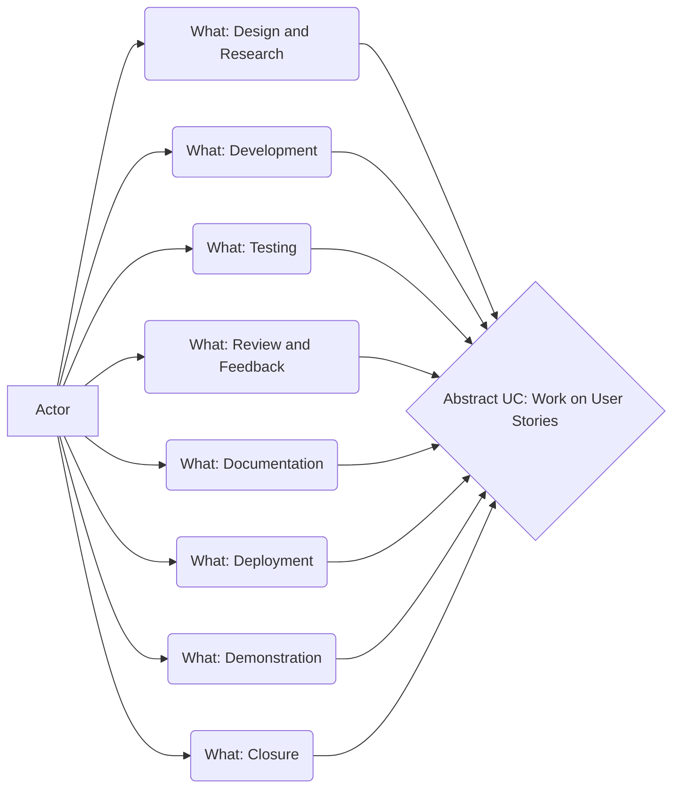

# 100 - Work on User Stories

Our board is at https://wvanheemstra.storiesonboard.com

Log into StoriesonBoard at https://app.storiesonboard.com/login

Username: wvanheemstra@icloud.com

## 100 - What

### 100 - Design and Research

See [README.md](./100/100/README.md)

### 200 - Development

See [README.md](./100/200/README.md)

### 300 - Testing

See [README.md](./100/300/README.md)

### 400 - Review and Feedback

See [README.md](./100/400/README.md)

### 500 - Documentation

See [README.md](./100/500/README.md)

### 600 - Deployment

See [README.md](./100/600/README.md)

### 700 - Demonstration

See [README.md](./100/700/README.md)

### 800 - Closure

See [README.md](./100/800/README.md)

Mark the user story as **done** in the project management tool.

Move the story to the **done** column on the board.
