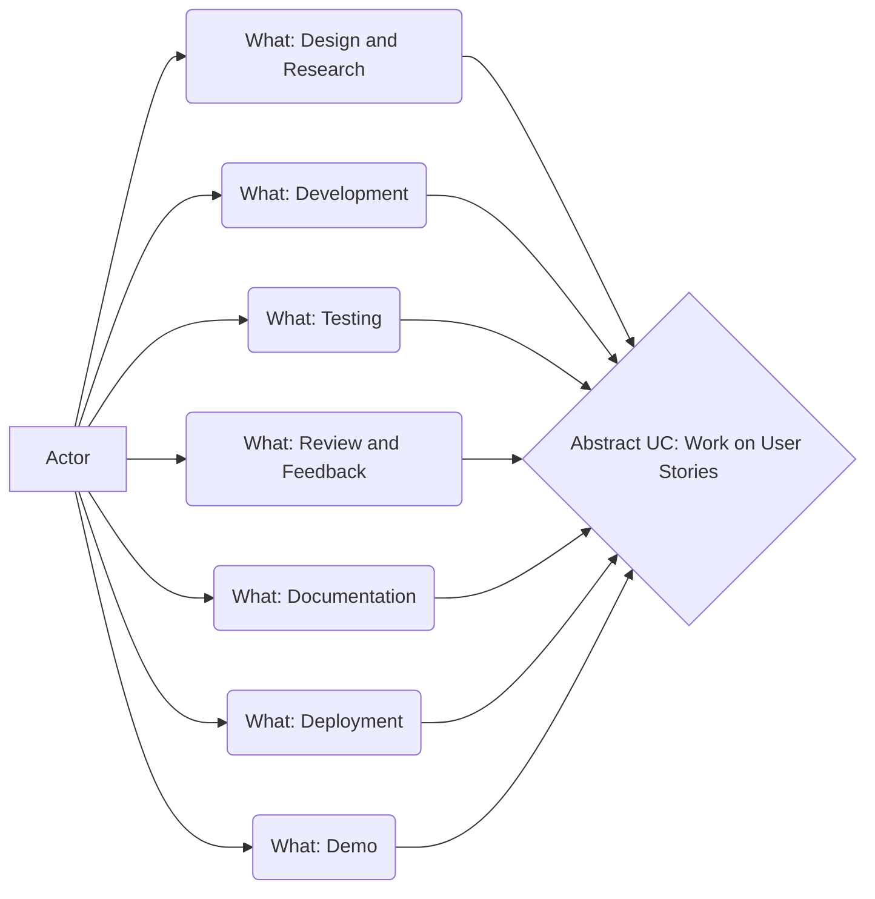

# 100 - Work on User Stories

Our board is at https://wvanheemstra.storiesonboard.com

Log into StoriesonBoard at https://app.storiesonboard.com/login

Username: wvanheemstra@icloud.com

## 100 - Design and Research

See [README.md](./100/README.md)

Conduct any necessary research or design work.

Create wireframes, mockups, or architectural diagrams if needed.

## 200 - Development

See [README.md](./200/README.md)

Write code to implement the user story

Follow coding standrads and best practices.

Commit code regularly to the version control system.

## 300 - Testing

See [README.md](./300/README.md)

Write and run unit tests.

Conduct integration testing.

Perform user acceptance testing (UAT) based on the acceptance criteria.

## 400 - Review and Feedback

See [README.md](./400/README.md)

Conduct a code review with peers.

Address any feedback or required changes.

## 500 - Documentation

See [README.md](./500/README.md)

Update any relevant documentation (e.g., API docs, user guides).

Ensure comments and code are well-documented.

## 600 - Deployment

See [README.md](./600/README.md)

Deploy the feature to a staging environment.

Verify the deployment process.

## 700 - Demo

See [README.md](./700/README.md)

Demonstrate the completed user story to the Product Owner and stakeholders.

Gather feedback and make necessary afdjustments.

## 800 - Close the Story

Mark the user story as done in the project management tool.

Move the story to the done column on the board.
