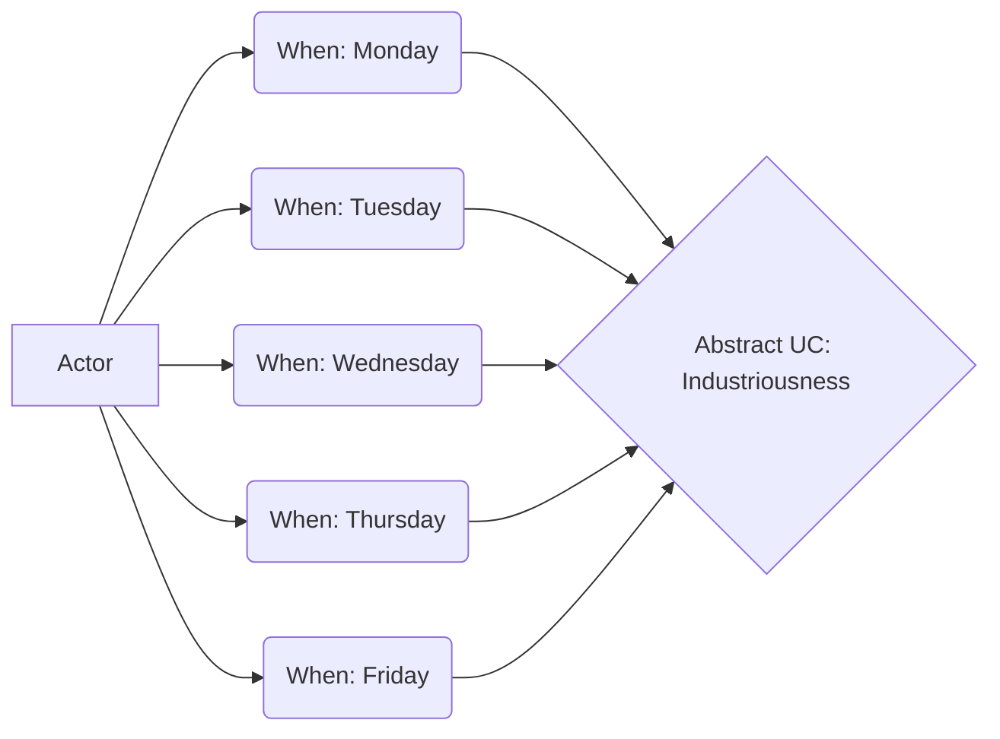

# 300 - Managing Our Activity

## 100 - When

## 200 - What

## 300 - How

### 100 - Open Communications

See [README.md](./300/100/README.md)

### 200 - Monitor "Industriousness" Channel

See [README.md](./300/200/README.md)

### 300 - Open Planning

See [README.md](./300/300/README.md)

### 400 - Monitor "Industriousness" Workspace

MORE
