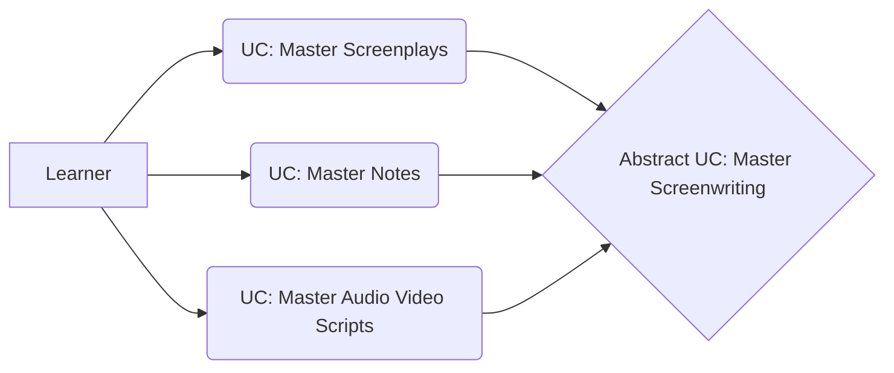
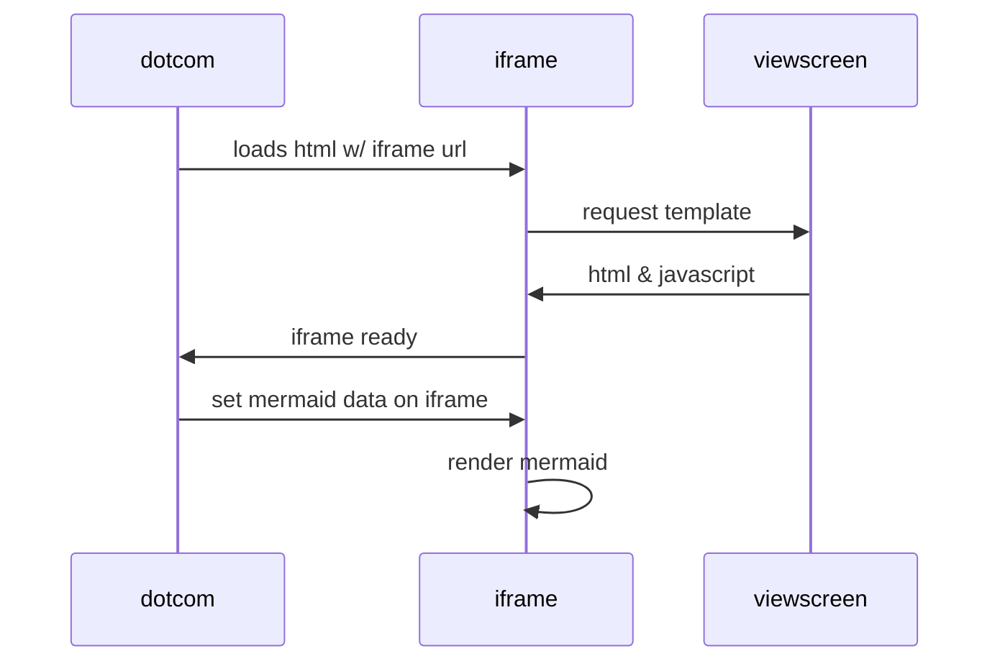

# 300 - Managing Our Activity

```mermaid
flowchart LR
  A[Learner] --> B(UC: Master Screenplays)
  A[Learner] --> C(UC: Master Notes)
  A[Learner] --> D(UC: Master Audio Video Scripts) 
  B --> F{Abstract UC: Master Screenwriting}
  C --> F{Abstract UC: Master Screenwriting}
  D --> F{Abstract UC: Master Screenwriting}
```

```mermaid
sequenceDiagram
    participant dotcom
    participant iframe
    participant viewscreen
    dotcom->>iframe: loads html w/ iframe url
    iframe->>viewscreen: request template
    viewscreen->>iframe: html & javascript
    iframe->>dotcom: iframe ready
    dotcom->>iframe: set mermaid data on iframe
    iframe->>iframe: render mermaid
```
