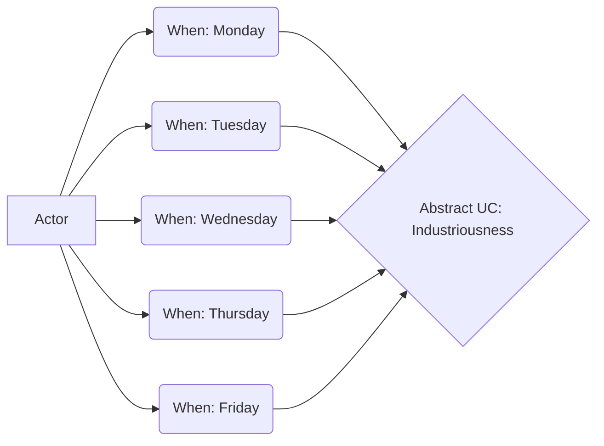
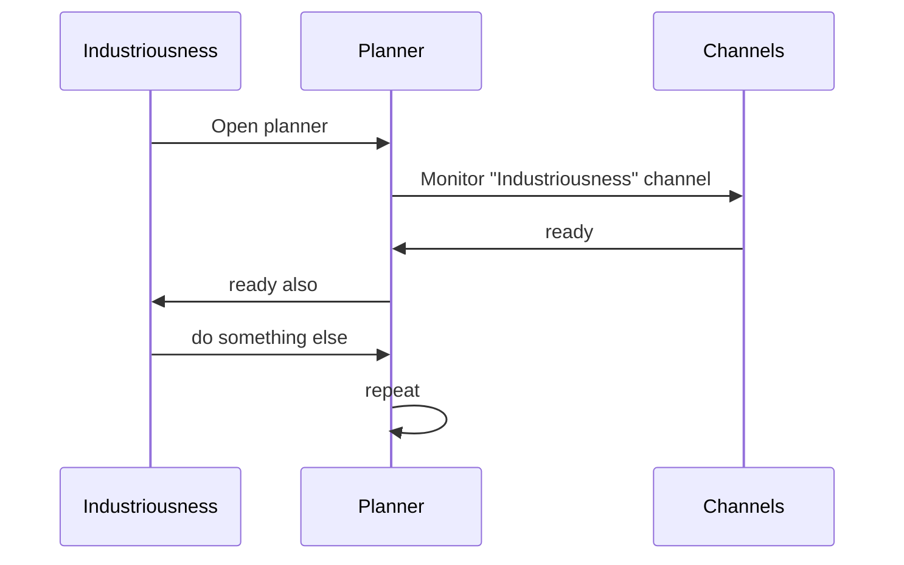

# 300 - Managing Our Activity

## 100 - When

```mermaid
flowchart LR
  A[Actor] --> B(When: Monday)
  A[Actor] --> C(When: Tuesday)
  A[Actor] --> D(When: Wednesday)
  A[Actor] --> E(When: Thursday)
  A[Actor] --> F(When: Friday)
  B --> G{Abstract UC: Industriousness}
  C --> G{Abstract UC: Industriousness}
  D --> G{Abstract UC: Industriousness}
  E --> G{Abstract UC: Industriousness}
  F --> G{Abstract UC: Industriousness}
```

## 200 - What

```mermaid
sequenceDiagram
    participant Industriousness
    participant Planner
    participant Channels
    Industriousness->>Planner: Open planner
    Planner->>Channels: Monitor "Industriousness" channel
    Channels->>Planner: ready
    Planner->>Industriousness: ready also
    Industriousness->>Planner: do something else
    Planner->>Planner: repeat
```

## 300 - How

### 100 - Open Planner

See [README.md](./300/100/README.md)
