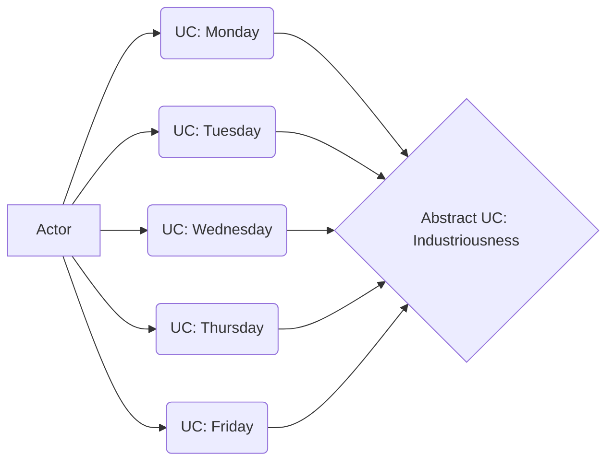
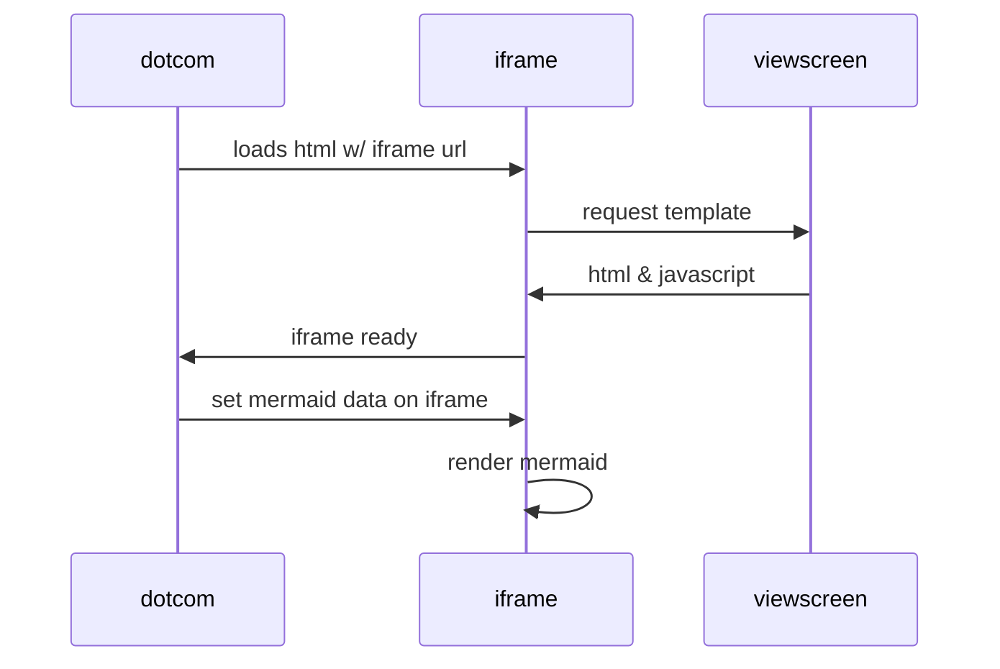

# 300 - Managing Our Activity

## 100 - When

```mermaid
flowchart LR
  A[Actor] --> B(UC: Monday)
  A[Actor] --> C(UC: Tuesday)
  A[Actor] --> D(UC: Wednesday)
  A[Actor] --> E(UC: Thursday)
  A[Actor] --> F(UC: Friday)
  B --> G{Abstract UC: Industriousness}
  C --> G{Abstract UC: Industriousness}
  D --> G{Abstract UC: Industriousness}
  E --> G{Abstract UC: Industriousness}
  F --> G{Abstract UC: Industriousness}
```

## 200 - What

```mermaid
sequenceDiagram
    participant dotcom
    participant iframe
    participant viewscreen
    dotcom->>iframe: loads html w/ iframe url
    iframe->>viewscreen: request template
    viewscreen->>iframe: html & javascript
    iframe->>dotcom: iframe ready
    dotcom->>iframe: set mermaid data on iframe
    iframe->>iframe: render mermaid
```
